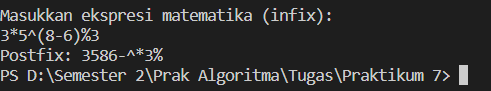

**Algoritma dan Struktur Data 2021-2022** 

**Nama : Andhito Galih Nur Cahyo**

**Kelas : 1F**

**No absen : 06**

**Nim : 2141720138**

**JOBSHEET VII**

**STACK**

**7.1 Tujuan Praktikum**

Setelah melakukan materi praktikum ini, mahasiswa mampu:

1. Mengenal struktur data Stack
2. Membuat dan mendeklarasikan struktur data Stack
3. Menerapkan algoritma Stack dengan menggunakan array

**7.2 Praktikum 1**
Pada percobaan ini, kita akan membuat program yang mengilustrasikan tumpukan pakaian yang disimpan ke dalam stack. Karena sebuah pakaian mempunyai beberapa informasi, maka implementasi Stack dilakukan dengan menggunakan array of object untuk mewakili setiap elemennya.

**7.2.1 Langkah-langkah Percobaan**

**7.2.2 Verifikasi Hasil Percobaan**


**7.2.3 Pertanyaan**
1. Berapa banyak data pakaian yang dapat ditampung di dalam stack? Tunjukkan potongan kode 
program untuk mendukung jawaban Anda tersebut!
2. Perhatikan class StackMain, pada saat memanggil fungsi push, parameter yang dikirimkan adalah 
p. Data apa yang tersimpan pada variabel p tersebut?
```
stk.push(p);
```
3. Apakah fungsi penggunaan do-while yang terdapat pada class StackMain?
4. Modifikasi kode program pada class StackMain sehingga pengguna dapat memilih operasi-operasi pada stack (push, pop, peek, atau print) melalui pilihan menu program dengan 
memanfaatkan kondisi IF-ELSE atau SWITCH-CASE!

**Jawaban**
1. Data pakaian yang dapat ditampung di dalam stack sebanyak 9, Di bawah ini terdapat parameter 8 yang menandakan maksimal isi stack berjumlah 9


2. Data yang tersimpan pada variable p adalah data yang akan diimputkan ke dalam stsck

3. Fungsinya yaitu memasukkan inputan user ke dalam program jika ingin menambahkan data ke stack.

4. - Code:

    ```
    class StackMainPertanyaan{
        public static void main(String[] args) {
            Stack stk = new Stack(5);
            Scanner sc = new Scanner(System.in);
            Scanner sc1 = new Scanner(System.in);
            Scanner sc2 = new Scanner(System.in);
            Scanner sc3 = new Scanner(System.in);
            Scanner sc4 = new Scanner(System.in);

            char pilih, ulang;
            int pil;
            do{
                System.out.println("======================================================");
                System.out.println("                     DATA PAKAIAN                     ");
                System.out.println("======================================================");
                System.out.println("Pilihan Pemanggilan Fungsi: ");
                System.out.println("1. Push  ");
                System.out.println("2. Pop  ");
                System.out.println("3. Peek  ");
                System.out.println("4. Print  ");
                System.out.print("\nMasukkan pilihan: ");
                pil = sc.nextInt();
                switch(pil){
                    case 1:
                        do{
                            System.out.print("Jenis: ");
                            String jenis = sc1.nextLine();
                            System.out.print("Warna: ");
                            String warna = sc2.nextLine();
                            System.out.print("Merk: ");
                            String merk = sc3.nextLine();
                            System.out.print("Ukuran: ");
                            String ukuran = sc4.nextLine();
                            System.out.print("Harga: ");
                            double harga = sc.nextDouble();
                
                            Pakaian p = new Pakaian(jenis, warna, merk, ukuran, harga);
                            System.out.print("Apakah Anda akan menambahkan data baru ke stack (y/n)? ");
                            pilih = sc.next().charAt(0);
                            sc.nextLine();
                            stk.push(p);
                        }while(pilih == 'y' || pilih == 'Y');
                    case 2:
                    stk.pop();
                    break;

                    case 3:
                    stk.peek();
                    break;

                    case 4:
                    stk.print();
                    break;

                    default:
                    System.out.println("Inputan yang Anda masukkan salah!");
                }
                
                System.out.print("Apakah ingin melakukan pemanggilan fungsi lagi? (Y/N)");
                ulang = sc.next().charAt(0);
            }while(ulang == 'y' || ulang == 'Y');
            System.out.println("Terima kasih");
        }
    }
    ```


**7.3 Praktikum 2**
Pada percobaan ini, kita akan membuat program untuk melakukan konversi notasi infix menjadi 
notasi postfix.

**7.3.1 Langkah-langkah Percobaan**

**7.3.2 Verifikasi Hasil Percobaan**


**7.3.3 Pertanyaan**
1. Perhatikan class Postfix, jelaskan alur kerja method derajat!
2. Apa fungsi kode program berikut?
```
c = Q.charAt (i);
```
3. Jalankan kembali program tersebut, masukkan ekspresi 3*5^(8-6)%3. Tampilkan hasilnya!

4. Pada soal nomor 3, mengapa tanda kurung tidak ditampilkan pada hasil konversi? Jelaskan!

**Jawaban**

1. Method **derajat** ialah ketika input yang dimasukkan berupa operator:
    - '^', maka akan me-return nilai 3
    - '%', '/', dan '*', maka akan me-return nilai 2
    - '+' dan '-', maka akan me-return nilai 1
    - Jika selain itu, maka akan me-return nilai 0

2. Kode program tersebut digunakan untuk mengecek setiap setiap karakter yang ada sebelum dimasukkan ke postfix, akan dipisah terlebih dahulu antara operand dan operator, setelah itu postfix akan dilakukan.
3. 


4. Karena tanda kurung yang ada tersebut akan di-pop kan saja tanpa dimasukkan ke dalam postfix

**Tugas**
1. Perhatikan dan gunakan kembali kode program pada Praktikum 1. Tambahkan method getMin pada class Stack yang digunakan untuk mencari dan
enampilkan data pakaian dengan harga terendah dari semua data pakaian yang tersimpan di dalam stack!

**Jawaban**
Code
```
public class Pakaian1{
    String jenis, warna, merk, ukuran;
    double harga;

    Pakaian1(String jenis, String warna, String merk, String ukuran, double harga){
        this.jenis = jenis;
        this.warna = warna;
        this.merk = merk;
        this.ukuran = ukuran;
        this.harga = harga;
    }
}
public class StackTugas1 {
        int size;
        int top;
        Pakaian1 data[];
    
        public StackTugas(int size){
            this.size = size;
            data = new Pakaian1[size];
            top = -1;
        }
    
        public boolean IsEmpty(){
            if (top == -1){
                return true;
            }else{
                return false;
            }
        }
    
        public boolean IsFull(){
            if (top == size-1){
                return true;
            }else{
                return false;
            }
        }
    
        public void push(Pakaian1 pkn){
            if ( !IsFull()){
                top++;
                data[top] = pkn;
            }else{
                System.out.println("Isi stack penuh!");
            }
        }
    
        public void pop(){
            if (!IsEmpty()){
                Pakaian1 x = data[top];
                top--;
                System.out.println("Data yang keluar: " + x.jenis + " "+ x.warna + " " +
                x.merk + " " + x.ukuran + " " + x.harga);
            }else{
                System.out.println("Stack masih kosong");
            }
        }
    
        public void peek(){
            System.out.println("Elemen teratas: "+ data[top].jenis + " " + data[top].warna + " " +
            data[top].merk + " " + data[top].ukuran + " " + data[top].harga);
        }
    
        public void print(){
            System.out.println("Isi stack: ");
            for(int i=top; i>=0; i--){
                System.out.println(data[i].jenis + " " + data[i].warna + " " + data[i].merk + " " +
                data[i].ukuran + " " + data[i].harga + " ");
            }
            System.out.println("");
        }
    
        public void clear(){
            if(!IsEmpty()){
                for (int i=top; i>=0; i++){
                    top--;
                }
                System.out.println("Stack sudah dikosongkan");
            }else{
                System.out.println("Stack masih kosong");
            }
        }
    
        public void getMin() {
            if (!IsEmpty()) {
                int idxMin = 0;
                for (int i = 0; i <= top; i++) {
                    if (data[i].harga < idxMin) {
                        idxMin = i;
                    }
                }
                System.out.println("Harga pakaian terkecil: " + data[idxMin].jenis + " " + data[idxMin].warna + " " +
                data[idxMin].merk + " " + data[idxMin].ukuran + " " + data[idxMin].harga);
            } else {
                System.out.println("Stack masih kosong");
            }
        }
    }

import java.util.Scanner;
public class StackMain1 {
        public static void main(String[] args) {
            Stack stk = new Stack(5);
            Scanner sc = new Scanner(System.in);
    
            char pilih;
            do{
                System.out.print("Jenis: ");
                String jenis = sc.nextLine();
                System.out.print("Warna: ");
                String warna = sc.nextLine();
                System.out.print("Merk: ");
                String merk = sc.nextLine();
                System.out.print("Ukuran: ");
                String ukuran = sc.nextLine();
                System.out.print("Harga: ");
                double harga = sc.nextDouble();
    
                Pakaian1 p = new Pakaian1(jenis, warna, merk, ukuran, harga);
                System.out.print("Apakah Anda akan menambahkan data baru ke stack (y/n)? ");
                pilih = sc.next().charAt(0);
                sc.nextLine();
                stk.push(p);
            }while(pilih == 'y' || pilih == 'Y');
        
            stk.print();
            stk.pop();
            stk.peek();
            stk.print();
            stk.getMin();
        }
    }

```

Output


2. Setiap hari Minggu, Dewi pergi berbelanja ke salah satu supermarket yang berada di area rumahnya. Setiap kali selesai berbelanja, Dewi menyimpan struk belanjaannya di dalam laci. Setelah dua bulan, ternyata Dewi sudah mempunyai delapan struk belanja. Dewi berencana mengambil lima struk belanja untuk ditukarkan dengan voucher belanja.Buat sebuah program stack untuk menyimpan data struk belanja Dewi, kemudian lakukan juga 
proses pengambilan data struk belanja sesuai dengan jumlah struk yang akan ditukarkan dengan voucher. Informasi yang tersimpan pada struk belanja terdiri dari:
- Nomor transaksi
- Tanggal pembelian
- Jumlah barang yang dibeli
- Total harga bayar
Tampilkan informasi struk belanja yang masih tersimpan di dalam stack!

**Jawaban**

Code
```
public class belanja {
    int top, size, jmlBrg, totalHrg;
    String noTrans, waktu;
    belanja[] stack;

    public belanja(String noTrans, int jmlBrg, int totalHrg, String waktu){
        this.noTrans = noTrans;
        this.jmlBrg = jmlBrg;
        this.totalHrg = totalHrg;
        this.waktu = waktu;
    }

    public belanja(int size){
        this.size = size;
        this.top =-1;
        stack = new belanja[this.size];
    }

    public boolean IsEmpty(){
        if(top <= -1){
            return true;
        }else{
            return false;
        }
    }

    public boolean IsFull(){
        if(top >= size-1){
            return true;
        }else{
            return false;
        }
    }

    public void push(belanja stk){
        if(!IsFull()){
            top++;
            stack[top] = stk;
        }else{
            System.out.println("Data sudah full!");
        }
    }

    public void pop(){
        if(!IsEmpty()){
            belanja st = stack[top];
            top--;
            line(50);
            System.out.printf("Nomor Transaksi: %-10s\n", st.noTrans);
            System.out.printf("Tanggal: %-20s\n", st.waktu);
            line(50);
            System.out.printf("Jumlah Barang: %-6d\n", st.jmlBrg);
            System.out.printf("Total: Rp. %d\n", st.totalHrg);
            line(50);
        }
    }
    
    public void line (int pjg){
        for(int i=0; i<pjg; i++){
            System.out.print("=");
        }
        System.out.println();
    }
    
    public void print(){
        line(50);
        System.out.println("\t\t   ISI STACK                   ");
        line(50);
        for(int i=top; i>=0; i--){
            line(50);
            System.out.printf("Nomor Transaksi: %-10s\n", stack[i].noTrans);
            System.out.printf("Tanggal: %-20s\n", stack[i].waktu);
            line(50);
            System.out.printf("Jumlah Barang: %-6d\n", stack[i].jmlBrg);
            System.out.printf("Total: Rp. %d\n", stack[i].totalHrg);
            line(50);
        }
        System.out.println();
    }
}
import java.util.Date;
import java.text.SimpleDateFormat;

public class BelanjaMain {
        public static void main(String[] args) {
            Date waktu = new Date();
            
            SimpleDateFormat sdf = new SimpleDateFormat("EEEE,dd MMMM YYYY");
            
            belanja struk = new belanja(8);
            belanja[] belanjaDewi = new belanja[8];
            String date = sdf.format(waktu);
            
            belanjaDewi[0] = new belanja("aaaa-010-221", 12, 1200000, date);
            belanjaDewi[1] = new belanja("aaaa-020-221", 2, 1100000, date);
            belanjaDewi[2] = new belanja("aaaa-013-242", 21, 1500000, date);
            belanjaDewi[3] = new belanja("aaaa-524-242", 3, 160000, date);
            belanjaDewi[4] = new belanja("aaaa-310-551", 5, 1298000, date);
            belanjaDewi[5] = new belanja("aaaa-940-645", 10, 200000, date);
            belanjaDewi[6] = new belanja("aaaa-784-215", 9, 3200000, date);
            belanjaDewi[7] = new belanja("aaaa-425-254", 8, 1800000, date);
            
            for (int i = 0; i < struk.size; i++) {
                struk.push(belanjaDewi[i]);
            }
            struk.print();
            struk.line(50);
            System.out.println("\tData yang di-pop |struk 5 minggu|");
            struk.line(50);
            for (int i = 0; i < 5; i++) {
                struk.pop();
            }
            struk.print();
        }
    }

```
Output :


